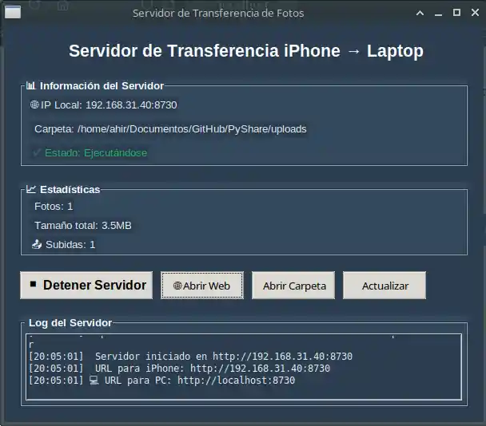
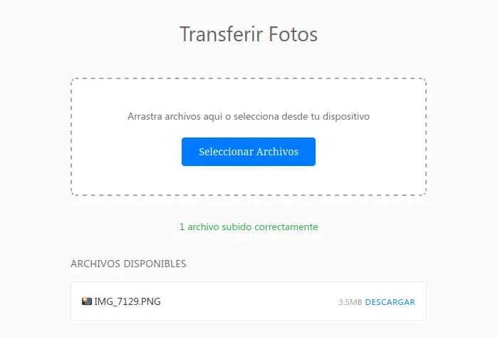

# PyShare

Transfiere fotos desde el navegador de tu movil a tu pc,laptop.

# Capturas




## ¿Qué hace?

PyShare crea un servidor web local que te permite:

- Subir fotos desde cualquier navegador movil a tu pc 
- Ver todas tus fotos transferidas en una interfaz bonita
- Descargar las fotos a tu laptop con un solo clic
- Monitorear el progreso en tiempo real

## Cómo usar

### 1. Instala las dependencias

```bash
pip install flask pillow werkzeug tkinter
```

### 2. Ejecuta la aplicación

```bash
python3 app.py
```

### 3. Transfiere tus fotos

1. En la ventana que se abre, haz clic en **"Iniciar Servidor"**
2. Abre Safari en tu iPhone o Android y ve a la URL que aparece (ej: `http://192.168.1.100:8730`)
3. Arrastra tus fotos a la página web o toca "Seleccionar Fotos"
4. ¡Listo! Tus fotos aparecerán en la carpeta `uploads/`


## Configuración avanzada

Puedes modificar estas variables en `app.py`:

- `PORT = 8730` - Puerto del servidor
- `MAX_SIZE = 100MB` - Tamaño máximo por archivo
- `UPLOAD_FOLDER = 'uploads'` - Carpeta de destino
